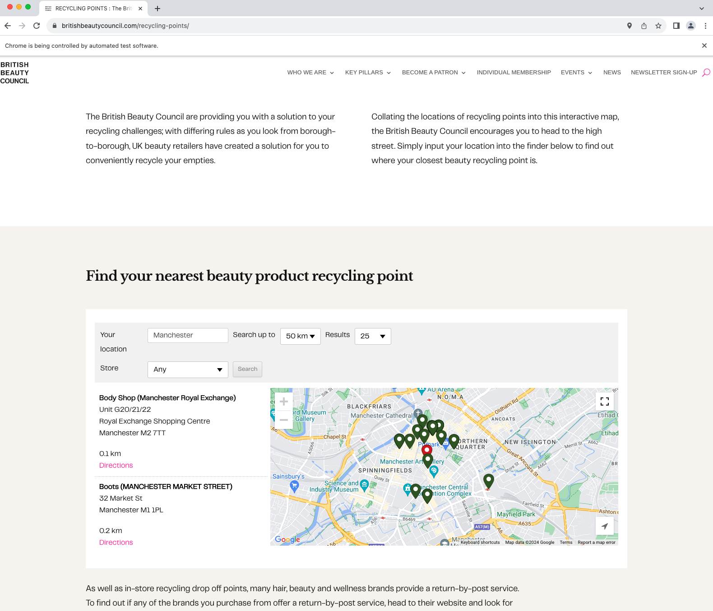

# SeleniumWebCrawler

A tool to automatically crawl a website with Selenium WebDriver and extract data to a Firebase NoSQL cloud database.

<p float="left">
  
</p>

## How-to guide

1. The tool automatically opens a search engine Web page, fills up the search box and starts the search. The elements to search are so specified:

```
final String searchPageUrl = "https://britishbeautycouncil.com/recycling-points/";
final String searchBoxElementName = "wpsl-search-input";
final String searchButtonElementId = "wpsl-search-btn";
final String searchCriteria = "Manchester";
```

2. A JSON file describes the search result page Document Object Model (DOM), as well as the local variables (e.g. `$point_name"`) where to store the extraced data:
```
{
  "tag": "div",
  "attributes": [
    {
      "key": "id",
      "value": "wpsl-stores"
    }
  ],
  "children": [
    {
      "tag": "ul",
      "children": [
        {
          "tag": "li",
          "attributes": [
            {
              "key": "data-store-id",
              "value": "$point_id"
            }
          ],
          "children": [
            {
              "tag": "div",
              "attributes": [
                {
                  "key": "class",
                  "value": "wpsl-store-location"
                }
              ],
              "children": [
                {
                  "tag": "p",
                  "children": [
                    {
                      "tag": "strong",
                      "value": "$point_name"
                    },
                    {
                      "tag": "span",
                      "attributes": [
                        {
                          "key": "class",
                          "value": "wpsl-street"
                        }
                      ],
                      "value": "$point_address",
                      "isMultiple": true
                    },
                    {
                      "tag": "span",
                      "value": "$point_city",
                      "isMultiple": true
                    }
                  ]
                }
              ]
            }
          ],
          "isMultiple": true
        }
      ]
    }
  ]
}
```

3. Finally, the parsed data structure is stored into Firebase Cloud Firestore: https://firebase.google.com/docs/firestore .
